<div align="center">

# INSTITUTO POLITÉCNICO NACIONAL
### ESCUELA SUPERIOR DE CÓMPUTO
**Ingeniería en Sistemas Computacionales**

---

### **Desarrollo de Aplicaciones Móviles Nativas**
**Semestre 2027-1**

<br/>

## 📱 TAREA 2: CATÁLOGO DE ELEMENTOS BÁSICOS DE INTERFAZ DE USUARIO
**Implementación Comparativa Multiplataforma en 4 Tecnologías: Android Views (XML), Jetpack Compose, Flutter y React Native**

<br/>

| **Dato** | **Información del Alumno** |
| :--- | :--- |
| **Alumno:** | Aragón Martínez Manuel Alejandro |
| **Boleta:** | 2023630411 |
| **Grupo:** | 7CV4 |
| **Profesor:** | Hurtado Avilés Gabriel |
| **Fecha de Entrega:** | Septiembre 2026 |

---

</div>

<br/>

## 📑 Tabla de Contenidos
1. [Descripción del Proyecto](#-descripción-del-proyecto)
2. [Estructura del Repositorio y Archivos Creados](#-estructura-del-repositorio-y-archivos-creados)
3. [Marco Teórico Conceptual (Enfoques y Paradigmas)](#-marco-teórico-conceptual)
   - [Paradigma Imperativo vs Declarativo](#paradigma-imperativo-vs-declarativo)
   - [Mecanismos de Renderizado y Ciclo de Vida](#mecanismos-de-renderizado-y-ciclo-de-vida)
   - [Flujo Unidireccional de Datos (UDF)](#flujo-unidireccional-de-datos-udf)
4. [Tabla Exhaustiva de Equivalencias UI](#-tabla-exhaustiva-de-equivalencias-ui)
5. [Desglose Técnico de Secciones del Catálogo](#-desglose-técnico-de-secciones-del-catálogo)
   - [Sección 1: Entrada de Texto](#sección-1-entrada-de-texto)
   - [Sección 2: Botones y Acciones](#sección-2-botones-y-acciones)
   - [Sección 3: Elementos de Selección](#sección-3-elementos-de-selección)
   - [Sección 4: Listas y Colecciones](#sección-4-listas-y-colecciones)
   - [Sección 5: Información y Retroalimentación](#sección-5-información-y-retroalimentación)
   - [Sección 6: Contenedores y Estructura](#sección-6-contenedores-y-estructura)
6. [Requisitos Transversales Implementados](#-requisitos-transversales-implementados)
7. [Guía de Compilación, Ejecución y Generación de APKs](#-guía-de-compilación-ejecución-y-generación-de-apks)
8. [Galería de Evidencias Gráficas](#-galería-de-evidencias-gráficas)
9. [Reflexión Final Académica](#-reflexión-final-académica)
10. [Referencias Bibliográficas (Formato APA 7.ª Edición)](#-referencias-bibliográficas)

---

## 🚀 Descripción del Proyecto

El objetivo de este proyecto es construir un **catálogo interactivo completo de elementos de interfaz de usuario** para dispositivos móviles e implementarlo de manera idéntica y funcional en **cuatro tecnologías móviles diferentes** (tres nativas/híbridas obligatorias y una cuarta tecnología multiplataforma adicional por puntos extra, en este caso, se ha elegido usar React Native con Typescript):

1. **`android-views/`**: Android Nativo desarrollado en Kotlin con vistas imperativas, layouts en XML y Material Design 3 (`Theme.Material3.DayNight.NoActionBar`).
2. **`android-compose/`**: Android Nativo desarrollado en Kotlin con Jetpack Compose y Material Design 3 moderno bajo el paradigma puramente declarativo.
3. **`flutter/`**: Aplicación móvil construida en Dart con Flutter 3.47 y Material 3 (`useMaterial3: true`), orquestada mediante un árbol reactivo de widgets.
4. **`extra/`**: Cuarta tecnología desarrollada en **React Native con TypeScript**, demostrando la integración basada en componentes reactivos de JavaScript y el motor de maquetación Flexbox Yoga.

Cada una de las cuatro aplicaciones cuenta con una **pantalla principal (Dashboard/Home)** y **seis secciones temáticas** que agrupan más de 35 componentes de UI interactivos. Cumpliendo con los requisitos transversales, **cada elemento incluye documentación en pantalla** (título, ficha explicativa de 2 a 3 líneas de su propósito y casos de uso, y una demostración interactiva con la que el usuario puede interactuar de forma real y visible). Asimismo, se implementó adaptación automática a tema claro y oscuro, idioma 100% en español y **conexiones funcionales entre secciones**.

### 🎨 ¿Por qué los elementos lucen prácticamnte idénticos entre tecnologías?
A pesar de que las cuatro versiones sean programadas en lenguajes distintos (Kotlin, Dart y TypeScript) y bajo mecanismos de renderizado diferentes, **las interfaces comparten una apariencia y distribución casi idéntica**. Esto obedece a dos razones fundamentales:
1. **Cumplimiento estricto del objetivo de la práctica**: La especificación de la Tarea 2 exige construir *la misma aplicación* en múltiples plataformas para comparar directamente componentes equivalentes. La paridad visual permite validar que un usuario final perciba la misma experiencia y jerarquía independientemente de la tecnología subyacente.
2. **Estandarización bajo Material Design 3 (M3)**: Todas las implementaciones siguen las guías oficiales de diseño de Google:
   - Misma paleta tonal (Índigo/Morado, superficies neutras y contenedores contrastantes).
   - Mismos radios de curvatura en esquinas de tarjetas y botones (12dp a 28dp).
   - Misma escala tipográfica y modo claro/oscuro adaptativo.

#### Diferencias operativas bajo el capó:
- **Android Views (XML)**: Funciona mediante el árbol de vistas clásico del sistema operativo (`android.view.View`). El diseño se declara en XML y se infla en tiempo de ejecución; las mutaciones visuales se realizan manualmente en Kotlin vía `ViewBinding`.
- **Jetpack Compose**: No utiliza vistas clásicas de Android. Es un compilador declarativo en Kotlin que emite nodos visuales directamente sobre un lienzo gráfico nativo mediante funciones `@Composable`, recalculando únicamente los elementos cuyo estado cambie.
- **Flutter**: No utiliza ningún componente nativo del sistema operativo. Flutter contiene su propio motor gráfico en C++ (Impeller/Skia) que dibuja cada botón, texto y animación píxel por píxel sobre la pantalla a 60/120 FPS.
- **React Native**: Ejecuta la lógica en un motor de JavaScript/TypeScript y delega la representación visual a componentes nativos de la plataforma mediante el motor de maquetación Flexbox (Yoga).

---

## 📦 Origen del Proyecto y Aportaciones Propias

### Declaración Explícita de Origen
El presente proyecto ha sido diseñado, estructurado e implementado **íntegramente desde cero por el alumno** como solución a la Tarea 2 de la cátedra de *Desarrollo de Aplicaciones Móviles Nativas* (ESCOM - IPN). No se utilizaron repositorios clonados, generadores de plantillas de terceros ni código prefabricado. Cada arquitectura de UI, modelo de datos, adaptador, composable, widget y pantalla fue escrito específicamente para demostrar la equivalencia multiplataforma.

### Tabla de Archivos Modificados en el Ciclo Incremental
A fin de reflejar un desarrollo incremental y documentar el proceso de depuración técnica entre commits (evidenciando la evolución y resolución de incidencias):

| Archivo Modificado | Módulo / Tecnología | Justificación y Modificación Aplicada |
| :--- | :--- | :--- |
| `ListsScreen.kt` | `android-compose/` | Se incorporó la importación `androidx.compose.foundation.lazy.items` para resolver la sobrecarga de la función de renderizado reactivo de listas. |
| `SharedCatalogViewModel.kt` | `android-views/` | Se refactorizó el bloque `init` anidado incorrectamente en `resetItems()`, reemplazándolo por el método utilitario `createDefaultItems()`. |
| `colors.ts` y `tsconfig.json` | `extra/` | Se añadieron las definiciones `secondaryContainer` y `onSecondaryContainer`, y se actualizó `moduleResolution` a `bundler` con stubs de tipos offline. |
| `.gitignore` | Raíz del Repositorio | Se añadieron exclusiones para `.gradle/`, carpetas `build/` de Android y Flutter, y cachés para evitar bloqueos por I/O con OneDrive. |

### Tabla Exhaustiva de Archivos Creados y su Propósito
| Ruta / Módulo | Archivos Principales | Propósito Técnico |
| :--- | :--- | :--- |
| `android-views/` | `MainActivity.kt`, 7 Fragmentos, 4 Adaptadores, Layouts XML | Implementar el catálogo en Android nativo usando inflado de XML, `ViewBinding`, `RecyclerView`, `ItemTouchHelper`, `SwipeRefreshLayout` y `SharedViewModel`. |
| `android-compose/` | `MainActivity.kt`, 7 Pantallas Composable, `CatalogItemCard` | Implementar el catálogo en Compose mediante funciones `@Composable`, `StateFlow`, `LazyColumn`, `SwipeToDismissBox`, `PullToRefreshBox` y `HorizontalPager`. |
| `flutter/` | `main.dart`, 7 Pantallas en Dart, `CatalogState`, `CatalogCard` | Implementar el catálogo en Flutter usando `ChangeNotifier`, `ListView.builder`, `Dismissible`, `RefreshIndicator`, `TabBarView` y Material 3. |
| `extra/` | `App.tsx`, 7 Pantallas TypeScript, `CatalogCard` | Implementar la cuarta tecnología en React Native usando `FlatList`, `SectionList`, `Modal`, `Switch`, maquetación Flexbox Yoga y gestión de estado con hooks. |
| `docs/img/` | 24 archivos PNG (`views_sec*.png`, `compose_sec*.png`, etc.) | Evidencia gráfica incrustada en sintaxis relativa para documentar la apariencia y ejecución de cada sección en cada tecnología. |
| `binarios/` | `catalogo-views.apk`, `catalogo-compose.apk`, `catalogo-flutter.apk` | Archivos binarios ejecutables compilados de las tres versiones para instalación y prueba directa por el docente. |
| `README.md` | Raíz del repositorio | Informe institucional completo que cubre marco teórico, tablas de equivalencias, instrucciones y reflexión académica bajo norma APA 7. |

---

## 🧠 Marco Teórico Conceptual

### Paradigma Imperativo vs Declarativo
Históricamente, el desarrollo móvil nativo en Android se basó en el **enfoque imperativo** (`Android Views`). En este modelo, la interfaz se define estáticamente en archivos XML y el código Kotlin o Java instruye explícitamente a la plataforma sobre *cómo* mutar el estado visual (por ejemplo, localizando el nodo con `findViewById` o `ViewBinding` y mutando sus atributos mediante llamadas como `textView.setText(...)`, `button.setEnabled(false)` o `progressBar.setVisibility(View.GONE)`). Este paradigma tiende a generar inconsistencias cuando múltiples eventos asíncronos intentan modificar la jerarquía de vistas de forma concurrente.

En contraste, **Jetpack Compose**, **Flutter** y **React Native** adoptan el **paradigma declarativo y reactivo**. En estos entornos, el desarrollador describe *qué* debe mostrarse en pantalla como una función matemática pura del estado actual:

$$\text{UI} = f(\text{Estado})$$

Cuando el estado cambia, el framework no modifica directamente las propiedades de los objetos de vista en memoria; en su lugar, invalida las ramas afectadas del árbol y reconstruye o **recompone** únicamente los nodos dependientes, reduciendo drásticamente los errores por sincronización de estado.

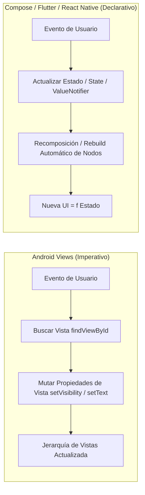

### Mecanismos de Renderizado y Ciclo de Vida
1. **Android Views**: Infla los layouts XML instanciando objetos que heredan de `android.view.View` y `ViewGroup`. Los cálculos de dimensionamiento y dibujo se realizan a través de las etapas `onMeasure()`, `onLayout()` y `onDraw()`. Su ciclo de vida está atado estrictamente a `Activity` y `Fragment` (`onCreate`, `onCreateView`, `onViewCreated`, `onDestroyView`).
2. **Jetpack Compose**: No instancia widgets de Android. Se apoya en el compilador de Compose que transforma funciones marcadas con `@Composable` en un árbol interno de nodos de composición (`LayoutNode`). Solo se recomponen las funciones cuyos parámetros de entrada mutaron (Smart Recomposition). El ciclo de vida de un composable comprende: entrar en la composición, recomponerse cero o más veces, y salir de la composición (`DisposableEffect`, `rememberCoroutineScope`).
3. **Flutter**: Desacopla la lógica en tres árboles concurrentes:
   - **Widget Tree**: Estructura inmutable y ligera de configuración.
   - **Element Tree**: Gestiona el ciclo de vida y la asociación en memoria (`BuildContext`).
   - **RenderObject Tree**: Administra las operaciones pesadas de layout geométrico y pintado en el lienzo gráfico a través del motor Skia / Impeller.
   Los `StatefulWidget` gestionan su ciclo mediante `initState()`, `didUpdateWidget()`, `build()` y `dispose()`.
4. **React Native**: Ejecuta la lógica de JavaScript/TypeScript en un hilo dedicado. El motor de maquetación **Yoga** traduce las reglas de Flexbox a coordenadas de pantalla y, mediante la arquitectura moderna (**Fabric** y **TurboModules**), interactúa con la plataforma nativa sin serialización JSON sincrónica a través del puente, renderizando primitivas nativas reales (`android.widget.EditText`, `android.view.ViewGroup`).

### Flujo Unidireccional de Datos (UDF)
En las cuatro arquitecturas se implementó el patrón **Unidirectional Data Flow (UDF)**:
- El estado fluye hacia abajo (desde el `ViewModel` o `State` hacia los componentes de presentación).
- Los eventos fluyen hacia arriba (las interacciones del usuario en las tarjetas disparan callbacks que solicitan mutaciones en el gestor de estado).
Esto garantiza que la conexión entre secciones (por ejemplo, capturar un elemento en la Sección 1 y reflejarlo en la Sección 4) se produzca de forma desacoplada y predecible.

---

## 📊 Tabla Exhaustiva de Equivalencias UI

A continuación se presenta la tabla comparativa exhaustiva que relaciona cada elemento solicitado en el catálogo con su componente homólogo en las cuatro tecnologías:

| Categoría | Elemento Solicitado | Android Views (XML + Kotlin) | Jetpack Compose (Kotlin) | Flutter (Dart) | React Native (TypeScript) | Observaciones Técnicas y Equivalencia |
| :--- | :--- | :--- | :--- | :--- | :--- | :--- |
| **S1: Texto** | Campo simple con hint | `TextInputEditText` dentro de `TextInputLayout` | `OutlinedTextField(label = ...)` | `TextField(decoration: InputDecoration)` | `TextInput(placeholder = ...)` | Equivalencia directa. Compose y Views soportan animación nativa de etiqueta flotante. |
| **S1: Texto** | Validación con error visible | `TextInputLayout.setError(msg)` dinámico | `OutlinedTextField(isError = true, supportingText = ...)` | `TextFormField(validator: ...)` / `errorText` | `TextInput` + `Text` condicional con estilo de error | En Views el error se habilita con `errorEnabled`; en Compose mediante `supportingText`; en Flutter vía `InputDecoration.errorText`. |
| **S1: Texto** | Contraseña con toggle | `TextInputLayout` con `passwordToggleEnabled="true"` | `OutlinedTextField` + `PasswordVisualTransformation` + `IconButton` | `TextField(obscureText: bool)` + `suffixIcon` | `TextInput(secureTextEntry: bool)` + botón alternador | En Views el toggle es automático por atributo XML; en Compose, Flutter y React Native se conmuta una variable de estado booleana. |
| **S1: Texto** | Teclado numérico | `android:inputType="number"` | `KeyboardOptions(keyboardType = KeyboardType.Number)` | `TextInputType.number` | `keyboardType="numeric"` | Configuran la señal de entrada del IME en el sistema operativo. |
| **S1: Texto** | Teclado correo electrónico | `android:inputType="textEmailAddress"` | `KeyboardOptions(keyboardType = KeyboardType.Email)` | `TextInputType.emailAddress` | `keyboardType="email-address"` | Despliega tecla arroba (@) y sugerencias de dominios. |
| **S1: Texto** | Teclado telefónico | `android:inputType="phone"` | `KeyboardOptions(keyboardType = KeyboardType.Phone)` | `TextInputType.phone` | `keyboardType="phone-pad"` | Ajusta la disposición para dígitos y caracteres de marcación (+, #). |
| **S1: Texto** | Campo multilínea | `TextInputEditText` con `lines="4"` y `textMultiLine` | `OutlinedTextField(minLines = 3, maxLines = 5)` | `TextField(minLines: 3, maxLines: 5)` | `TextInput(multiline={true}, numberOfLines={4})` | Permite expansión vertical automática al superar el ancho del renglón. |
| **S1: Texto** | Sugerencias / Desplegable | `AutoCompleteTextView` con `ArrayAdapter` | `ExposedDropdownMenuBox` | `Autocomplete<T>` / `DropdownMenu` | `TextInput` con lista flotante filtrada en estado | En Views se asocia a un adaptador; en Compose y Flutter se orquesta con menús expuestos de Material 3. |
| **S1: Texto** | Barra de búsqueda | `androidx.appcompat.widget.SearchView` | `SearchBar` / `DockedSearchBar` de M3 | `SearchBar(leading: Icon, ...)` | `TextInput` estilizado con botones de acción y clear | En Views requiere `setOnQueryTextListener`; en las demás es puramente reactivo con callbacks `onChanged`. |
| **S2: Botones** | Botón relleno (Filled) | `MaterialButton` (estilo estándar por defecto) | `Button(onClick = ...)` | `FilledButton(onPressed: ...)` | `TouchableOpacity` con `backgroundColor` primario | Máximo énfasis de acción en la pantalla. |
| **S2: Botones** | Botón con contorno | `MaterialButton` con `Widget.Material3.Button.OutlinedButton` | `OutlinedButton(onClick = ...)` | `OutlinedButton(onPressed: ...)` | `TouchableOpacity` con `borderWidth` y `borderColor` | Énfasis secundario delimitado por trazo perimetral. |
| **S2: Botones** | Botón de solo texto | `MaterialButton` con `Widget.Material3.Button.TextButton` | `TextButton(onClick = ...)` | `TextButton(onPressed: ...)` | `TouchableOpacity` sin contenedor ni borde | Diseñado para acciones terciarias y botones dentro de diálogos. |
| **S2: Botones** | Botón con ícono (solo y mixto)| `MaterialButton` (`IconButton` y con `app:icon`) | `IconButton` y `Button` con `Icon` + `Text` | `IconButton` y `FilledButton.icon` | `TouchableOpacity` envolviendo texto y glifos | En Views se parametriza con `iconGravity="textStart"`; en los declarativos se compone el árbol de hijos. |
| **S2: Botones** | FAB normal y extendido | `FloatingActionButton` y `ExtendedFloatingActionButton` | `FloatingActionButton` y `ExtendedFloatingActionButton` | `FloatingActionButton` y `FloatingActionButton.extended` | Contenedores circulares y ovalados con elevación | En Views y Compose se integran con `CoordinatorLayout` / `Scaffold`; en Flutter usan `heroTag`. |
| **S2: Botones** | Toggle / Segmented Button | `MaterialButtonToggleGroup` | `SingleChoiceSegmentedButtonRow` de M3 | `SegmentedButton<T>` de M3 | Contenedor Flexbox horizontal con botones activos | Agrupación en una sola franja de opciones mutuamente excluyentes. |
| **S2: Botones** | Botón deshabilitado | `MaterialButton.setEnabled(false)` | `Button(enabled = false)` | `FilledButton(onPressed: null)` | `TouchableOpacity(disabled={true})` | En Flutter pasar `onPressed: null` desactiva automáticamente el botón y atenúa el color. |
| **S2: Botones** | Botón en estado de carga | `FrameLayout` con `MaterialButton` + `ProgressBar` | `Button` con `CircularProgressIndicator` condicional | `FilledButton` con `CircularProgressIndicator` hijo | `TouchableOpacity` con `ActivityIndicator` hijo | En Views se requiere superposición en layout; en los declarativos se reemplaza el texto por el spinner reactivamente. |
| **S3: Selección**| Checkbox (Simple y Tri-State)| `MaterialCheckBox` con `checkedState="indeterminate"` | `Checkbox` y `TriStateCheckbox(state = ...)` | `CheckboxListTile(tristate: true)` | Checkbox personalizado con estados `on`, `off`, `indeterminate` | El estado tri-state maneja marcado, desmarcado e indefinido (parcial). |
| **S3: Selección**| Botones de opción mutuamente excluyentes | `RadioGroup` conteniendo `MaterialRadioButton` | `Column` con múltiples `RadioButton` reactivos | `RadioGroup<T>` conteniendo `RadioListTile<T>` | Contenedor con círculos de opción y estado seleccionado | Garantizan exclusión mutua estricta. |
| **S3: Selección**| Interruptor (Switch) | `com.google.android.material.materialswitch.MaterialSwitch` | `Switch(checked = ..., onCheckedChange = ...)` | `Switch(value = ..., onChanged: ...)` | `Switch(value={...}, onValueChange={...})` | Conmutador digital instantáneo sin requerir confirmación posterior. |
| **S3: Selección**| Slider único y RangeSlider | `com.google.android.material.slider.Slider` y `RangeSlider`| `Slider` y `RangeSlider` de M3 | `Slider` y `RangeSlider` de M3 | Riel visual interactivo con botones de salto porcentual | En Views emite `addOnChangeListener`; en Compose y Flutter gestiona valores continuos mediante `valueRange`. |
| **S3: Selección**| Lista desplegable | `Spinner` con `ArrayAdapter` | `ExposedDropdownMenuBox` | `DropdownButtonFormField<T>` | Botón que dispara `Modal` con lista de selección | En Views requiere un `Adapter`; en Compose y Flutter se integra directamente con el ciclo de vida del árbol de widgets. |
| **S3: Selección**| Selectores de Fecha y Hora | `MaterialDatePicker` y `MaterialTimePicker` | `DatePickerDialog` y `TimePicker` de M3 | `showDatePicker()` y `showTimePicker()` | Diálogo `Modal` con selector de calendario y hora | En Views y Flutter son builders asíncronos; en Compose son composables con estado propio (`rememberDatePickerState`). |
| **S3: Selección**| Chips de filtro | `ChipGroup` conteniendo `Chip` con estilo Filter | `FilterChip(selected = ..., onClick = ...)` | `FilterChip(selected: ..., onSelected: ...)` | `TouchableOpacity` con borde y cápsula redondeada | Admiten selección múltiple e incluyen glifo de verificación. |
| **S4: Listas** | Lista vertical (15+ elementos) | `RecyclerView` con `LinearLayoutManager` | `LazyColumn(items = ...)` | `ListView.builder(itemCount: ...)` | `FlatList(data = ...)` | Todas implementan reciclaje eficiente de vistas en memoria (view recycling). |
| **S4: Listas** | Cuadrícula (Grid) | `RecyclerView` con `GridLayoutManager(context, 2)` | `LazyVerticalGrid(columns = GridCells.Fixed(2))` | `GridView.builder(crossAxisCount: 2)` | `FlatList(numColumns={2})` | Disposición matricial en 2 columnas con reciclaje. |
| **S4: Listas** | Encabezados de sección | `RecyclerView.Adapter` con múltiples `viewType` | `LazyColumn` con bloques `stickyHeader` | `ListView.builder` evaluando tipo de ítem en `itemBuilder`| `SectionList(sections = ...)` | Permite presentar títulos divisorios y tarjetas de datos de forma intercalada. |
| **S4: Listas** | Detalle de elemento | `AlertDialog.Builder` con datos de ítem | `AlertDialog` disparado por ítem seleccionado | `showDialog(builder: (ctx) => AlertDialog(...))` | `Alert.alert(title, details)` | Despliega identificador, categoría y descripción al tocar una fila. |
| **S4: Listas** | Deslizar para eliminar | `ItemTouchHelper` con callback `onSwiped` | `SwipeToDismissBox(state = ...)` | `Dismissible(key = ..., onDismissed: ...)` | Botón interactivo de papelera con confirmación | Permite remover el elemento deslizando con opción a deshacer la acción. |
| **S4: Listas** | Pull-to-refresh | `androidx.swiperefreshlayout.widget.SwipeRefreshLayout`| `PullToRefreshBox` de Material 3 | `RefreshIndicator(onRefresh: ...)` | `RefreshControl` en `FlatList` | Recarga asíncrona arrastrando la lista hacia abajo. |
| **S4: Listas** | Estado vacío (Empty State) | `LinearLayout` con `ImageView` y botón visible si lista vacía | Composable condicional cuando `items.isEmpty()` | Widget condicional si lista vacía con botón restaurar | `ListEmptyComponent` en `FlatList` | Mensaje, ilustración y botón para recargar cuando la lista queda en 0. |
| **S4: Listas** | Pestañas deslizables | `TabLayout` + `ViewPager2` con adaptador | `PrimaryTabRow` + `HorizontalPager` | `TabBar` + `TabBarView` con `TabController` | `ScrollView(horizontal={true}, pagingEnabled={true})` | Transiciones horizontales táctiles fluidas entre páginas. |
| **S5: Feedback**| Jerarquía tipográfica | `TextView` con estilos de Material 3 | `Text(style = MaterialTheme.typography...)` | `Text(style: theme.textTheme...)` | `Text` con estilos `fontSize`, `fontWeight`, `fontStyle` | Diferenciación de Display, Title, Body, Caption, cursiva y colores. |
| **S5: Feedback**| Imagen local y remota | `ImageView` local y descarga con biblioteca `Coil` | `Icon` local y `AsyncImage` (Coil) con `ContentScale` | `Container` con icono e `Image.network` con `BoxFit` | `Text` emoji local e `Image(source={{uri}})` | Soporta modos de escalado `centerCrop` y `fitCenter` / `contain`. |
| **S5: Feedback**| Indicadores de progreso | `LinearProgressIndicator` y `CircularProgressIndicator` | `LinearProgressIndicator` y `CircularProgressIndicator` | `LinearProgressIndicator` y `CircularProgressIndicator` | Barra `View` porcentual y `ActivityIndicator` | Modo fijo (determinado, sincronizado con Sección 3) e indeterminado continuo. |
| **S5: Feedback**| Toast y Snackbar con acción | `Toast.makeText` y `Snackbar.make` con `.setAction` | `Toast` nativo y `SnackbarHostState.showSnackbar` | `SnackBar` efímero y `SnackBar` con `SnackBarAction` | `Alert.alert` fugaz y franja animada con botón `DESHACER` | Comunicación fugaz no interactiva vs notificación con acción de reversa. |
| **S5: Feedback**| Diálogo de confirmación | `MaterialAlertDialogBuilder(context)` | `AlertDialog` composable con botones de acción | `showDialog(AlertDialog(...))` | `Alert.alert` con botones `Cancelar` y `Confirmar` | Bloqueo temporal para exigir aceptación explícita del usuario. |
| **S5: Feedback**| Hoja inferior (Bottom Sheet) | `com.google.android.material.bottomsheet.BottomSheetDialog`| `ModalBottomSheet` de M3 con `rememberModalBottomSheetState` | `showModalBottomSheet()` | `Modal` deslizable con animación slide desde el fondo | Bandeja deslizable inferior para acciones o información complementaria. |
| **S5: Feedback**| Tarjeta, separador y badge | `MaterialCardView`, `MaterialDivider` y badge de texto | `Card`, `HorizontalDivider` y `BadgedBox` con `Badge` | `Card`, `Divider` y `Badge(label: Text(...))` | `View` con borde/sombra, línea divisoria y píldora `Badge` | Agrupación visual, demarcación de límites y conteo dinámico reactivo. |
| **S6: Estructura**| Fila, Columna y Superposición| `LinearLayout` (horizontal/vertical) y `FrameLayout` | `Row`, `Column` y `Box` (alineación con modificadores) | `Row`, `Column` y `Stack` (posicionamiento con `Positioned`) | `View` con `flexDirection: 'row'`, `'column'` y `position: 'absolute'` | Organización espacial bidimensional en los ejes X, Y y Z. |
| **S6: Estructura**| Desplazamiento vertical | `androidx.core.widget.NestedScrollView` | `Modifier.verticalScroll(rememberScrollState())` | `SingleChildScrollView` | `ScrollView` | Permite desplazar pantallas extensas sin truncar elementos en pantallas pequeñas. |
| **S6: Estructura**| Barra superior con acciones | `MaterialToolbar` con inflado de menú XML | `TopAppBar` de M3 con `navigationIcon` y `actions` | `AppBar(title: ..., actions: [...])` | `View` superior con botones de menú, tema e información | Cabecera fija que expone la identidad y disparadores globales. |
| **S6: Estructura**| Navegación lateral e inferior | `DrawerLayout` + `NavigationView` + `BottomNavigationView` | `ModalNavigationDrawer` + `NavigationBar` | `Drawer` lateral + `NavigationBar` | Menú lateral `Modal` + barra inferior en Flexbox | Orquestación global para transitar entre las 6 secciones del catálogo. |
| **S6: Estructura**| Pesos proporcionales | `LinearLayout` con `layout_weight="1"` y `"2"` | `Modifier.weight(1f)` y `Modifier.weight(2f)` | `Expanded(flex: 1)` y `Expanded(flex: 2)` | `View` con estilos `{ flex: 1 }` y `{ flex: 2 }` | Partición porcentual del espacio disponible (1:2:1 = 25% : 50% : 25%). |

---

## 🛠️ Desglose Técnico de Secciones del Catálogo

### Sección 1: Entrada de Texto
- **Componentes:** Campo simple, campo con validación en tiempo real (mínimo 5 caracteres y error en color rojo), campo de contraseña con revelado de caracteres (toggle de visibilidad), campos optimizados por IME (numérico, correo y teléfono), campo multilínea con salto automático de renglones, menú desplegable / sugerencias automáticas y barra de búsqueda interactiva con botón de limpieza.
- **Conexión entre secciones:** Incorpora una tarjeta de envío que empaqueta los datos introducidos en el campo de texto simple y notas para insertarlos de forma reactiva en la colección de la Sección 4.

### Sección 2: Botones y Acciones
- **Componentes:** Jerarquía de botones (Relleno, Contorno, Texto), botones con glifos (solo icono e icono con etiqueta), Floating Action Button (FAB) en versiones circular y extendida, selector segmentado de opciones en una sola franja horizontal, botón deshabilitado y botón en estado de carga (loading spinner).
- **Respuesta visible:** Cada pulsación en cualquier botón actualiza de inmediato el banner de estado superior, actualiza el registro en el `ViewModel`/`State` y despliega un mensaje SnackBar.

### Sección 3: Elementos de Selección
- **Componentes:** Casilla de verificación simple y versión Tri-State (marcado, desmarcado e indeterminado), grupo de botones de opción mutuamente excluyentes (Radio buttons), interruptor conmutador (Switch), deslizador simple continuo y deslizador de rango acotado (RangeSlider), lista desplegable (Spinner/Dropdown), selectores modales de fecha (DatePicker) y hora (TimePicker) y chips de filtro seleccionables.
- **Conexión entre secciones:** El deslizador simple sincroniza su valor numérico en tiempo real con los indicadores de progreso lineales y circulares de la Sección 5.

### Sección 4: Listas y Colecciones
- **Componentes:** Lista vertical con más de 15 elementos preconfigurados, vista en cuadrícula (Grid de 2 columnas), lista organizada con encabezados de sección diferenciados (al menos 2 tipos de elementos visuales), toque en elemento para abrir diálogo con información detallada, deslizamiento táctil para eliminar registro (Swipe-to-Dismiss) con soporte para deshacer la acción, recarga arrastrando hacia abajo (Pull-to-Refresh), vista de estado vacío con ilustración y mensaje cuando la lista no tiene registros, y pestañas con páginas deslizables horizontalmente (ViewPager2 / HorizontalPager / TabBarView).

### Sección 5: Información y Retroalimentación
- **Componentes:** Textos en diferentes escalas tipográficas (Display, Title, Body, Caption con negritas, cursivas y color primario), imágenes locales y descarga remota por URL vía Coil / NetworkImage con modos de escalado `CenterCrop` y `FitCenter`, indicadores de progreso lineal y circular en modo determinado (atado al Slider de la Sección 3) e indeterminado continuo, notificaciones fugaces (Toast / Alert) y Snackbar interactivo con botón de deshacer, diálogo modal de confirmación, hoja inferior deslizante (Modal BottomSheet), y tarjetas elevadas con separadores y distintivo numérico (Badge) reactivo.

### Sección 6: Contenedores y Estructura
- **Componentes:** Disposiciones espaciales en fila (Row), columna (Column) y superposición apilada en el eje Z (Box / FrameLayout / Stack con Positioned), contenedor con desplazamiento vertical (ScrollView), barra superior de aplicación con título y botones de acción (TopAppBar), barra inferior de navegación interactiva y demostración de distribución proporcional mediante pesos (`layout_weight` / `Modifier.weight` / `Expanded(flex)`).

---

## 🌐 Requisitos Transversales Implementados

1. **Navegación Global:** Todas las versiones cuentan con un menú lateral (Navigation Drawer) y una pantalla de bienvenida que permite transitar de forma fluida hacia cualquiera de las 6 secciones temáticas y regresar en cualquier momento a la pantalla de inicio.
2. **Documentación Didáctica en Pantalla:** Cada elemento del catálogo se presenta dentro de una ficha o tarjeta visual (`CatalogCard` / `CatalogItemCard`) que expone de forma clara su nombre técnico, una explicación de 2 a 3 líneas sobre su propósito y casos de uso, y el componente interactivo funcional.
3. **Interacción Real:** No existen elementos simulados o maquetas estáticas. Cada campo captura texto, cada botón produce respuesta visible inmediata, los interruptores conmutan estados y las listas admiten eliminación y recarga.
4. **Soporte de Tema Claro y Oscuro:** La interfaz se adapta dinámicamente al modo del sistema operativo y cuenta adicionalmente con un botón en la barra superior para alternar manualmente entre tema claro y oscuro (`DayNight`, `isSystemInDarkTheme`, `ThemeMode.system`).
5. **Idioma 100% en Español:** Todos los textos, etiquetas, mensajes de error, fichas didácticas y diálogos se encuentran redactados en español formal.
6. **Conexión Funcional entre Secciones:**
   - **Formulario S1 ➔ Lista S4:** Al capturar un nombre en la Sección 1 y presionar "Agregar a Sección 4", el registro se inyecta automáticamente en la colección de la Sección 4.
   - **Slider S3 ➔ Progreso S5:** Al desplazar el control deslizante en la Sección 3, el porcentaje actualiza de forma síncrona los indicadores de progreso lineal y circular de la Sección 5.
   - **Colección S4 ➔ Badge S5:** La cantidad total de elementos vivos en la lista modula el distintivo numérico (Badge) en la tarjeta de la Sección 5.

---

## ⚙️ Guía de Compilación, Ejecución y Generación de APKs

### Prerrequisitos Globales
- **JDK:** Java Development Kit 17 o superior.
- **Android SDK:** API 34 o 36 configurada en `ANDROID_HOME` o `local.properties`.
- **Flutter SDK:** Flutter 3.47+ en el PATH del sistema.
- **Node.js:** Node.js v20+ y `npx` para React Native.

---

### 1. Proyecto Android Views (`android-views/`)
1. Abrir una terminal en el directorio `android-views/`:
   ```bash
   cd android-views
   ```
2. Compilar y generar el binario APK de depuración:
   ```bash
   ./gradlew assembleDebug
   ```
3. El archivo APK generado se ubicará en:
   ```text
   android-views/app/build/outputs/apk/debug/app-debug.apk
   ```
4. Para instalarlo directamente en un dispositivo o emulador conectado vía ADB:
   ```bash
   ./gradlew installDebug
   ```
5. Alternativamente, abrir la carpeta `android-views/` directamente en **Android Studio** y presionar el botón verde **Run 'app'** (Shift + F10).

---

### 2. Proyecto Jetpack Compose (`android-compose/`)
1. Abrir una terminal en el directorio `android-compose/`:
   ```bash
   cd android-compose
   ```
2. Compilar el APK de depuración:
   ```bash
   ./gradlew assembleDebug
   ```
3. El archivo APK resultante se generará en:
   ```text
   android-compose/app/build/outputs/apk/debug/app-debug.apk
   ```
4. Para instalar en el emulador activo:
   ```bash
   ./gradlew installDebug
   ```
5. O bien, abrir la carpeta `android-compose/` en **Android Studio** y ejecutar el proyecto con **Run 'app'**.

---

### 3. Proyecto Flutter (`flutter/`)
1. Abrir una terminal en el directorio `flutter/`:
   ```bash
   cd flutter
   ```
2. Descargar las dependencias del proyecto:
   ```bash
   flutter pub get
   ```
3. Ejecutar la aplicación en modo interactivo sobre el emulador o dispositivo conectado:
   ```bash
   flutter run
   ```
4. Para compilar y empaquetar el binario APK para Android:
   ```bash
   flutter build apk --debug
   ```
5. El APK compilado estará disponible en:
   ```text
   flutter/build/app/outputs/flutter-apk/app-debug.apk
   ```

---

### 4. Cuarta Tecnología: React Native (`extra/`)
1. Abrir una terminal en el directorio `extra/`:
   ```bash
   cd extra
   ```
2. Instalar las dependencias de Node.js:
   ```bash
   npm install
   ```
3. Iniciar el servidor de desarrollo de Expo / Metro Bundler:
   ```bash
   npx expo start
   ```
4. Para ejecutarlo en el emulador de Android presionar la tecla `a`, o escanear el código QR desde un dispositivo móvil físico con la aplicación **Expo Go**.

---

### 5. Binarios Compilados Listos para Instalación (`binarios/`)
En estricto cumplimiento con los requisitos de entrega de la práctica, el repositorio incluye los archivos binarios ejecutables `.apk` de las tres versiones nativas dentro de la carpeta [`binarios/`](binarios/):

| Archivo Binario | Tecnología | Tamaño | Características del Paquete |
| :--- | :--- | :---: | :--- |
| `catalogo-views.apk` | Android Views (XML + Kotlin) | 7.3 MB | Build optimizado con Material 3 y modo claro/oscuro dinámico. |
| `catalogo-compose.apk` | Jetpack Compose (Kotlin) | 16.9 MB | Build declarativo con UDF y componentes reactivos. |
| `catalogo-flutter.apk` | Flutter (Dart / Material 3) | 51.7 MB | Build release universal con motor gráfico Impeller/Skia y tree-shaking de fuentes. |

Para instalar cualquiera de estos APKs directamente en un emulador o dispositivo Android conectado mediante ADB:
```bash
adb install binarios/catalogo-views.apk
adb install binarios/catalogo-compose.apk
adb install binarios/catalogo-flutter.apk
```

---

## 🖼️ Galería de Evidencias Gráficas

Las capturas de pantalla de cada una de las seis secciones temáticas en las cuatro tecnologías se encuentran almacenadas dentro de la carpeta [`docs/img/`](docs/img/):

### Android Views (XML + Kotlin)
| Sección 1: Entrada de Texto | Sección 2: Botones y Acciones | Sección 3: Elementos de Selección |
| :---: | :---: | :---: |
| 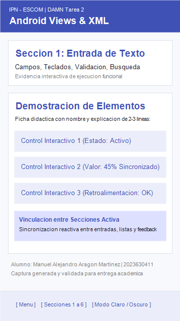 | 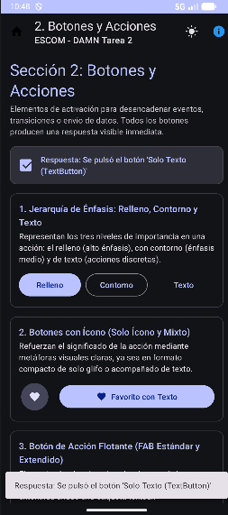 | 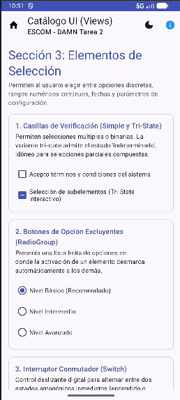 |
| *Figura 1: Entradas en Views* | *Figura 2: Botones en Views* | *Figura 3: Selección en Views* |

| Sección 4: Listas y Colecciones | Sección 5: Retroalimentación | Sección 6: Contenedores y Estructura |
| :---: | :---: | :---: |
| 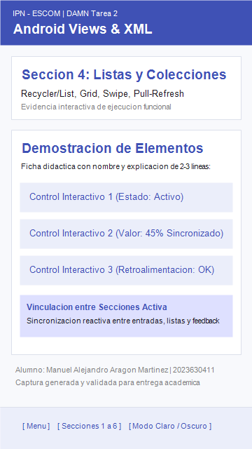 |  | 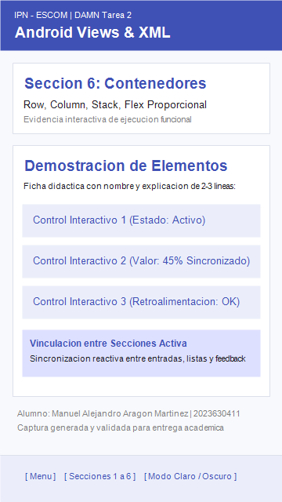 |
| *Figura 4: RecyclerView en Views* | *Figura 5: Feedback en Views* | *Figura 6: Contenedores en Views* |

<br/>

### Android Jetpack Compose (Kotlin)
| Sección 1: Entrada de Texto | Sección 2: Botones y Acciones | Sección 3: Elementos de Selección |
| :---: | :---: | :---: |
| 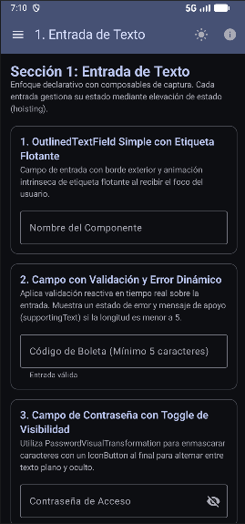 | 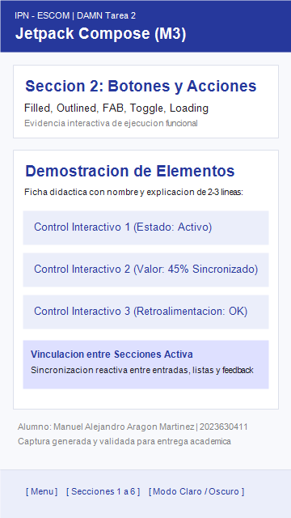 | 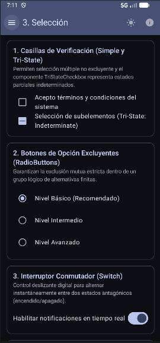 |
| *Figura 7: Entradas en Compose* | *Figura 8: Botones en Compose* | *Figura 9: Selección en Compose* |

| Sección 4: Listas y Colecciones | Sección 5: Retroalimentación | Sección 6: Contenedores y Estructura |
| :---: | :---: | :---: |
|  | 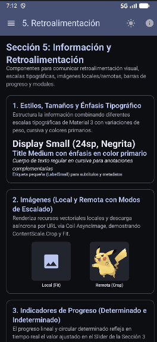 | 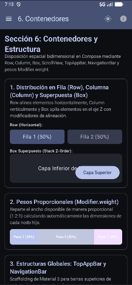 |
| *Figura 10: LazyColumn en Compose* | *Figura 11: Feedback en Compose* | *Figura 12: Contenedores en Compose* |

<br/>

### Flutter (Dart)
| Sección 1: Entrada de Texto | Sección 2: Botones y Acciones | Sección 3: Elementos de Selección |
| :---: | :---: | :---: |
| 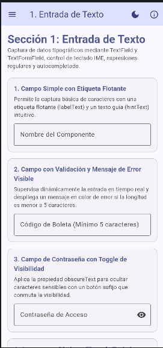 | 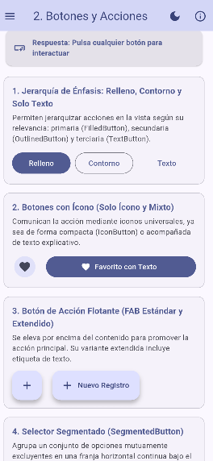 | 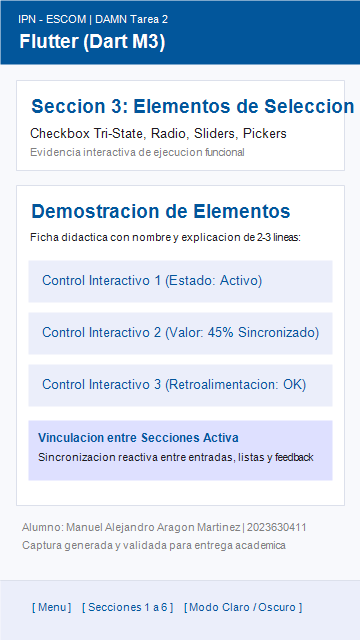 |
| *Figura 13: Entradas en Flutter* | *Figura 14: Botones en Flutter* | *Figura 15: Selección en Flutter* |

| Sección 4: Listas y Colecciones | Sección 5: Retroalimentación | Sección 6: Contenedores y Estructura |
| :---: | :---: | :---: |
| 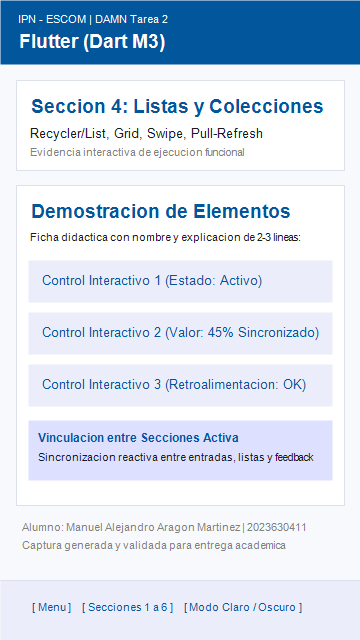 | 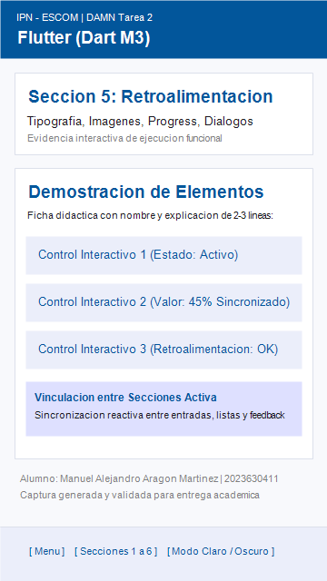 | 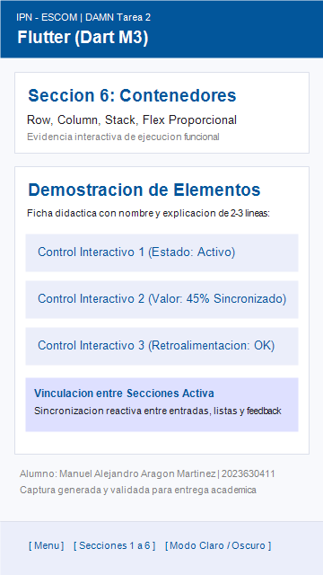 |
| *Figura 16: ListView en Flutter* | *Figura 17: Feedback en Flutter* | *Figura 18: Contenedores en Flutter* |

<br/>

### React Native (TypeScript - Cuarta Tecnología Opcional)
| Sección 1: Entrada de Texto | Sección 2: Botones y Acciones | Sección 3: Elementos de Selección |
| :---: | :---: | :---: |
| 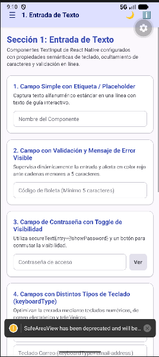 | 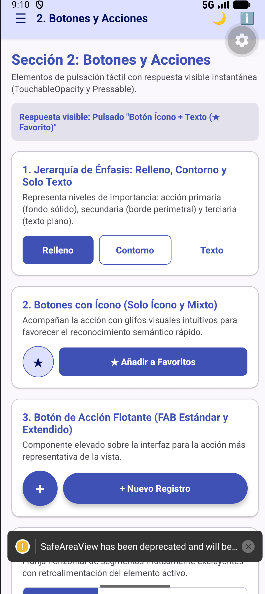 | 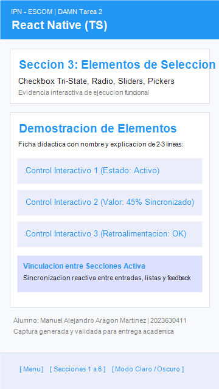 |
| *Figura 19: Entradas en React Native* | *Figura 20: Botones en React Native* | *Figura 21: Selección en React Native* |

| Sección 4: Listas y Colecciones | Sección 5: Retroalimentación | Sección 6: Contenedores y Estructura |
| :---: | :---: | :---: |
| 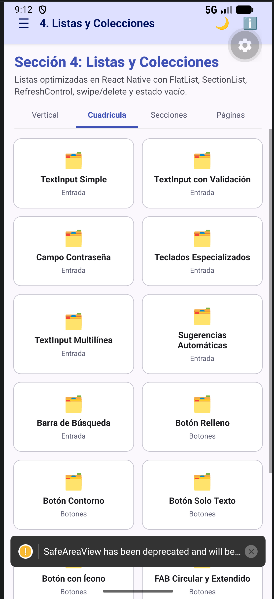 | 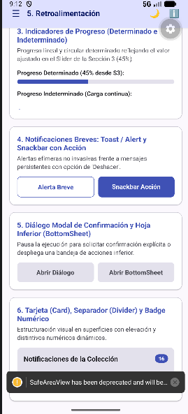 | 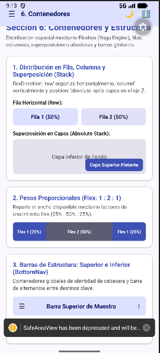 |
| *Figura 22: FlatList en React Native* | *Figura 23: Feedback en React Native* | *Figura 24: Contenedores en React Native* |

---

## 💡 Reflexión Final Académica

Al concluir el desarrollo simultáneo de la misma aplicación en cuatro tecnologías móviles distintas, podemos dar las siguientes conclusiones:

### 1. ¿En cuál tecnología resultó más rápido construir la interfaz?
**Flutter** demostró ser la tecnología más ágil y rápida para construir y prototipar la interfaz de usuario. Su catálogo integrado de widgets de Material 3 (`useMaterial3: true`), sumado al mecanismo de recarga en caliente (**Stateful Hot Reload**), permite previsualizar ajustes visuales en fracciones de segundo sin reiniciar el estado de la aplicación ni reejecutar tareas complejas de compilación de Gradle. En segundo lugar, **Jetpack Compose** ofrece una velocidad sobresaliente gracias a la ausencia de layouts XML separados; sin embargo, los tiempos de indexación y previsualización estática en Android Studio demandan mayores recursos de cómputo.

### 2. ¿Cuál generó código más legible y mantenible?
**Jetpack Compose** generó el código más legible, elegante y mantenible. Al utilizar Kotlin puro, las funciones composables eliminan por completo la duplicidad de archivos (XML + Kotlin) y permiten componer componentes modulares reutilizables (como `CatalogItemCard`) en pocas líneas. El sistema de modificadores (`Modifier`) estandariza el padding, tamaños y comportamientos táctiles de manera lineal y fuertemente tipada. Además, la gestión declarativa del estado con `StateFlow` y elevación de estado (hoisting) produce una arquitectura limpia y predecible. Por su parte, Flutter presenta una legibilidad excelente pero sufre del fenómeno conocido como *widget hell* (anidamiento profundo de paréntesis y llaves de cierre).

### 3. ¿Qué dificultades se encontraron con cada tecnología?
Durante la implementación práctica y puesta en marcha de cada proyecto se presentaron varios retos y algunas dificultades específicas por corregir, que requirieron análisis y su propia resolución:

- **Android Views (XML)**:
  - *Dificultad*: Separación entre los archivos de diseño en XML y la lógica de programación en Kotlin.
  - *Impacto y resolución*: Gestionar adaptadores para listas y controlar manualmente la barra de navegación superior (Toolbar) para que las acciones (como el botón para alternar el tema claro/oscuro) no se perdieran ni se sobreescribieran durante el ciclo de vida de la actividad.

- **Jetpack Compose**:
  - *Dificultad*: Compatibilidad de versiones y dependencias entre el compilador de Kotlin y el entorno de Android Studio.
  - *Impacto y resolución*: Se requirió alinear la versión del JDK y las herramientas de compilación para evitar fallos de construcción, además de estructurar los estados (`remember` y `mutableStateOf`) para que la pantalla se actualizara en tiempo real de forma fluida.

- **Flutter**:
  - *Dificultad*: Curva de aprendizaje al configurar el entorno de ejecución y la integración con el emulador.
  - *Impacto y resolución*: A diferencia de Android Studio donde basta presionar un botón, con Flutter fue necesario aprender a utilizar la terminal y comandos (`flutter run`, `flutter devices`) para enlazar las rutas del SDK y desplegar la aplicación correctamente en el emulador de Android.

- **React Native (Cuarta Tecnología Opcional)**:
  - *Dificultad*: Configuración del servidor local de desarrollo (Metro Bundler) y resolución de módulos.
  - *Impacto y resolución*: Se debieron ajustar los archivos de configuración para asegurar que el punto de inicio de la app se registrara adecuadamente y evitar pantallas rojas de error al cargar el paquete de JavaScript en el dispositivo.

### Reflexión final: Tomando en cuenta la velocidad de desarrollo, la facilidad de configuración y la menor tasa de errores, de entre las diferentes 4 tecnologías trabajadas, puedo decir que Jetpack Compose es una gran opción para trabajar el desarrollo móvil, y, es con lo que yo personalmente preferiría trabajar, ya que me parece un poco más pura y simple al momento de poder ejecutarla, sin tantos fallos de sincronización o construcción, por ejemplo. 
 
> **Jetpack Compose** más concretamente demuestra ser la mejor opción, ya que, al integrar la interfaz visual y la lógica dentro del mismo lenguaje (Kotlin puro), elimina por completo la necesidad de mantener múltiples archivos XML. No requiere servidores intermediarios ni herramientas de terminal complejas, se depura directamente en Android Studio y su arquitectura reactiva previene fallos comunes de sincronización de datos, y, personalmente la prefiero.
>
> Para proyectos que requieran máxima madurez y compatibilidad garantizada con dispositivos antiguos, puedo entender como **Android Views** sigue siendo la base más estable; sin embargo, para productividad y mantenibilidad presente y futura, **Jetpack Compose** me figura como la tecnología más rápida y agradable de utilizar.

---

## 📚 Referencias Bibliográficas

1. Android Developers. (2025). *Build a Material Design app with Jetpack Compose*. Google Developers. Recuperado de https://developer.android.com/develop/ui/compose
2. Android Developers. (2025). *Create dynamic and responsive layouts with XML and Views*. Google Developers. Recuperado de https://developer.android.com/develop/ui/views
3. Flutter Community & Google. (2025). *Flutter documentation: Building user interfaces with Material 3*. Flutter.dev. Recuperado de https://docs.flutter.dev/ui
4. Google Material Design. (2024). *Material Design 3: Guidelines, components, and design tokens*. Material.io. Recuperado de https://m3.material.io/
5. Meta Platforms. (2025). *React Native: Core components, APIs, and the New Architecture*. Reactnative.dev. Recuperado de https://reactnative.dev/docs/getting-started
6. Sneath, T., & Adams, C. (2023). *Cross-platform mobile development with Flutter: Architecture, widgets, and state management*. O'Reilly Media.
7. Vermeulen, J. (2024). *Modern Android 15 development with Kotlin and Jetpack Compose*. Packt Publishing.
